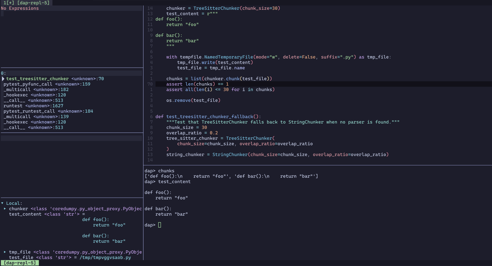

# Coredumpy.nvim
> Use [coredumpy](https://github.com/gaogaotiantian/coredumpy) with [nvim-dap](https://github.com/mfussenegger/nvim-dap)!

[Coredumpy](https://github.com/gaogaotiantian/coredumpy) is a Python post-mortem
debugging tool. It takes a snapshot of failed tests and saves the internals of
the program into a dump file to be inspected later. This plugin, inspired by
[the VSCode counterpart created by the creator of coredumpy](https://marketplace.visualstudio.com/items?itemName=gaogaotiantian.coredumpy-vscode)
creates a [neovim DAP session](https://github.com/mfussenegger/nvim-dap) so that 
you can inspect a dump file in your favourite editor.

## Installation & Configuration

[lazy.nvim](https://github.com/folke/lazy.nvim):
```lua
{
  "Davidyz/coredumpy.nvim",
  cmd = { "Coredumpy" },
  opts = {
    host = "127.0.0.1",
    port = 6742,
    python = nil,
    timeout_ms = 10000,
  },
  dependencies = { "mfussenegger/nvim-dap" }
}
```

`host` and `port` are hardcoded in coredumpy, so it's usually not necessary to
touch them. `python` would be the path to your interpreter, or a function that
returns the path. `timeout_ms` is the timeout for fetching dump file from Github
Action.

You'll also need to have [Coredumpy](https://github.com/gaogaotiantian/coredumpy) 0.4.1+
installed on your system/in your venv.

If you want to directly work with dump files [uploaded to Github Actions
artifacts](https://github.com/gaogaotiantian/upload-coredumpy), you'll also need
to have [`gh`](https://cli.github.com/) installed and configured, as well as the
`zcat` command, which is usually part of the `unzip` package.

### Working with Python Interpreters & Virtual Environments

By default (when `opts.python` is set to `nil`), coredumpy.nvim tries to pick 
up the `coredumpy` executable from `$PATH`. If it finds it, it'll be used to
start the debugger. Otherwise, it'll fallback to using `python` in your current
shell to start the debugger (equivalent to `python -m coredumpy host`). To
use a different interpreter (for a virtual environment, for example), you can
set `opts.python` to a string (path to the interpreter) or a function that
returns a string (return the path to the interpreter). This enables the plugin
to dynamically invoke the appropriate python interpreter.

For example, if you're using 
[venv-selector.nvim](https://github.com/linux-cultist/venv-selector.nvim) and
installed coredumpy in your virtual environments, you can use the following 
setup so that this plugin automatically pick up the virtual environment from 
venv-selector:
```lua
{
  "Davidyz/coredumpy.nvim",
  cmd = { "Coredumpy" },
  opts = function()
    return {
      -- This will call require("venv-selector").python() when you start a
      -- Coredumpy session.
      python = require("venv-selector").python,
    },
  end,
  dependencies = { "mfussenegger/nvim-dap", "linux-cultist/venv-selector.nvim" }
}
```


## Usage


> The UI is powered by [nvim-dap-ui](https://github.com/rcarriga/nvim-dap-ui).
> [nvim-dap-view](https://github.com/igorlfs/nvim-dap-view) _should_ work too
> but I haven't tested it because I don't use nvim nightly.

> For instructions to use coredumpy, see the 
> [upstream repo](https://github.com/gaogaotiantian/coredumpy) and 
> [this post](https://gaogaotiantian.medium.com/post-mortem-debugging-with-coredumpy-3b312f46354d)
> from the creator of coredumpy.

### Working with Local Dump Files
This plugin tries to replicate the behaviour of the 
[VSCode counterpart](https://marketplace.visualstudio.com/items?itemName=gaogaotiantian.coredumpy-vscode). 
It's an inspector of a dump file produced by [Coredumpy](https://github.com/gaogaotiantian/coredumpy).

Suppose your dump file is located at `path/to/dump/file.dump`, you can use the
following user command to initialise a debugging process: 
```
:Coredumpy path/to/dump/file.dump
```

### Working with Remote Dump Files

If you [deployed coredumpy on Github Action](https://github.com/gaogaotiantian/upload-coredumpy), 
you'll be given URLs to download the artifacts. There will be both a standard
Github URL that you can click to download the artifact from a browser:
```
https://github.com/<owner>/<repo>/actions/runs/<run_id>/artifacts/<artifact_id>
```
and a VSCode URL intended to use from VSCode:
```
vscode://gaogaotiantian.coredumpy-vscode/load-github-artifact?owner=<owner>&repo=<repo>&artifactId=<artifact_id>
```
This plugin is able to handle both of the URLs.
Simply run:
```
:Coredumpy <url>
```
Coredumpy.nvim will parse the URL, download the artifact to a temporary
directory and open it in nvim-dap, saving you the trouble of doing it manually.

## Credits
- [@gaogaotiantian](https://github.com/gaogaotiantian) for creating
  [coredumpy](https://github.com/gaogaotiantian/coredumpy) and fixing the reference ID issue;
- [debugpy.nvim](https://github.com/HiPhish/debugpy.nvim) for nvim-dap related
  code.
